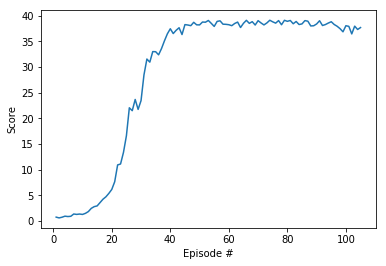

# Project Report

## Project Implementation
Different aspects of implementation have been mentioned below:

#### Learning Algorithm
The learning algorithm used to train the agents is [Deep Deterministic Policy Gradient][ddpg]. The model used to train the agent consists of two sub neural networks (actor and critic) with three fully-connected layers with ReLu activation function used to trigger the output of intermediate states. The first layer has size 400, second has size 300 while the third layer being the output layer is a hyperbolic tan action vector with values between -1 and 1.

[ddpg]: https://arxiv.org/abs/1509.02971

#### Hyperparameters
The following hyperparameters have been set for learning:

* The replay buffer size is 1 million.

* Learning batch size is selected as 1024.

* The discount rate is selected as 0.99.

* Soft-update rate of target weights is 1e-3.

* Learning-rate of 1e-3 is selected for both actor and critic networks.

## Results
The plot shows that the agents were able to get score of ~38 on continuous basis from 40 episodes onwards 

The environment was solved in 105 episodes with an average score of 30.36 for last 100 episodes over all agents.

## Future Ideas
For more stable performance, Trust Region Policy Optimization (TRPO) and Truncated Natural Policy Gradient (TNPG) can be implemented as discussed [here][link]. 

[link]: https://arxiv.org/abs/1604.06778 

[Proximal Policy Optimization (PPO)][PPO] has also demonstrated good performance with continuous control tasks.

[PPO]: https://openai.com/blog/openai-baselines-ppo/

A recent [Distributed Distributional Deterministic Policy Gradients (D4PG)][D4PG] algorithm is another method for adapting DDPG for continuous control.

[D4PG]: https://openreview.net/forum?id=SyZipzbCb
